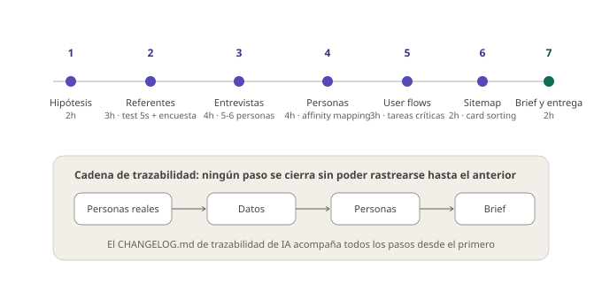

# Órbita 1 — Conocer a las personas
## Hoja de ruta (~20 horas)

  

    
Diapositivas del apartado

    
Los ocho pasos de la Órbita 1: qué se hace, con qué herramienta y cuántas horas.

  

  <a href="slides/orbita1_00_hoja_de_ruta.pdf" target="_blank" rel="noopener" style="background:#E93456; color:#FBFBF8; border:3px solid #240509; box-shadow:4px 4px 0 #240509; padding:14px 28px; font-weight:700; text-transform:uppercase; letter-spacing:1px; text-decoration:none; white-space:nowrap;">Descargar presentación →</a>

Esta guía secuencia el trabajo de la órbita. Cada paso indica qué se hace, con qué herramienta, qué produce y cuántas horas orientativas ocupa. Los apartados de los apuntes desarrollan el cómo de cada paso.

### Paso 1 — Definir la hipótesis de proyecto (2h)

Eliges el problema que tu producto va a resolver y lo formulas como **hipótesis**: "creo que las personas que [contexto] necesitan [objetivo] pero [fricción]". Abres el tablero de FigJam y el repositorio de GitHub con el `CHANGELOG.md` vacío. La hipótesis es provisional: los pasos siguientes la confirmarán, la matizarán o la desmontarán.

Produce: **hipótesis escrita en el tablero** + repositorio inicializado.

### Paso 2 — Investigar el terreno (3h)

Analizas dos o tres productos de referencia que ya operan sobre el mismo problema. Aplicas el **test de los cinco segundos** con Lyssna sobre una pantalla de cada uno para saber qué comunican en una primera impresión, y tomas nota de su estructura, su vocabulario y sus fricciones. En paralelo lanzas una **encuesta** con Tally para detectar patrones y reclutar entrevistados.

Produce: notas de análisis de referentes + resultados del test de 5 segundos + encuesta lanzada.

### Paso 3 — Entrevistar (4h)

Con las respuestas de la encuesta identificas perfiles y entrevistas a cinco o seis personas que encajen en ellos. Preguntas abiertas, foco en comportamiento real, **registro de consentimiento** y **datos anonimizados**. Las notas van al tablero de FigJam, una nota adhesiva por hallazgo.

Produce: notas de entrevista anonimizadas en FigJam.

### Paso 4 — Sintetizar y construir las personas (4h)

**Affinity mapping** sobre todas las notas: agrupas hallazgos por afinidad y los grupos que emergen revelan los patrones. De ahí salen tus dos o tres personas (una con diversidad funcional), cada una con su ficha: cita, contexto de uso, objetivos y frustraciones. Cada atributo debe poder rastrearse hasta un dato concreto. Si usas IA para la síntesis, primera entrada en el `CHANGELOG.md`.

Produce: fichas de personas en Figma, con jerarquía definida.

### Paso 5 — Mapear los user flows (3h)

Identificas las tres a cinco tareas críticas del producto y mapeas su flujo en FigJam: **happy path** y al menos dos o tres **casos límite** por flujo. Recorres cada flujo con cada persona como filtro, especialmente la de diversidad funcional, y anotas las decisiones que quedan abiertas.

Produce: user flows de las tareas críticas con casos límite anotados.

### Paso 6 — Card sorting y sitemap (2h)

**Card sorting** con cuatro o cinco compañeros. Con los agrupamientos resultantes y los flujos del paso anterior, construyes el **sitemap**: pantallas principales, secundarias y de sistema. Verificación cruzada: cada flujo crítico debe poder recorrerse sobre el sitemap en tres niveles o menos.

Produce: sitemap verificado contra los flujos.

### Paso 7 — Wireframear y prototipar (3h)

Con el sitemap y los user flows como referencia, produces los **wireframes lo-fi** en Figma: una pantalla por paso del happy path, en escala de grises, sin tipografía real ni color. Nombras cada frame con el nombre del paso del flujo al que corresponde. Una vez tienes todas las pantallas, las conectas con interacciones básicas para formar el **prototipo navegable**. Lo testeas con cuatro o cinco personas del perfil de tu persona principal usando Lyssna.

Produce: wireframes lo-fi + prototipo navegable en Figma, con resultados del test anotados.

### Paso 8 — Cerrar el brief y entregar (2h)

Conviertes la hipótesis del paso 1 en **brief definitivo**: problema respaldado por datos, alcance acotado por las tareas críticas, personas referenciadas, criterios de éxito verificables y restricciones. Revisas que los seis artefactos estén vinculados entre sí y que el `CHANGELOG.md` recoja todos los usos de IA de la órbita.

Produce: entregable completo de la Órbita 1 — brief, personas, user flows, sitemap, wireframes y prototipo navegable.

---

Las horas suman 23 y son orientativas. Las fases de entrevista y síntesis son las que más varían según la disponibilidad de participantes. Conviene empezar a reclutar desde el primer día.
