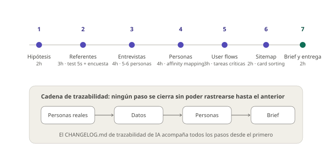

# Órbita 1 — Conocer a las personas
## Hoja de ruta

  

    
Diapositivas del apartado

    
Los ocho pasos de la Órbita 1, en el orden en que de verdad los vas a necesitar.

  

  <a href="../slides/orbita1_00_hoja_de_ruta.pdf" target="_blank" rel="noopener" style="background:#E93456 !important; color:#ffffff !important; border:3px solid #1F0318 !important; box-shadow:4px 4px 0 #1F0318 !important; padding:14px 28px; font-weight:700; text-transform:uppercase; letter-spacing:1px; text-decoration:none !important; white-space:nowrap; border-bottom:none !important;">Descargar presentación →</a>

¿Por dónde se empieza a diseñar algo que va a usar gente de verdad? No por Figma, desde luego. Se empieza por entender a quién le vas a resolver el problema, y eso te va a llevar ocho pasos a lo largo de las próximas cuatro semanas. No hace falta que te los aprendas de memoria: para eso está esta página. Lo que sí importa es el orden — cada paso existe porque el anterior le deja el terreno preparado, y saltarte uno se nota siempre, tarde o temprano, en el paso que viene después.

### Paso 1 — Apuesta por una hipótesis, aunque te dé miedo equivocarte

Todo empieza con una apuesta, no con una certeza: crees que ciertas personas, en cierto contexto, necesitan algo que ahora mismo no tienen bien resuelto. Eso es tu **hipótesis**, y se escribe así de claro: "creo que las personas que [contexto] necesitan [objetivo] pero [fricción]". Ábrete el tablero de FigJam con el que vas a trabajar todo el curso e inicializa el repositorio de GitHub con el `CHANGELOG.md` vacío.

No te obsesiones con acertar a la primera. La hipótesis es de usar y tirar: los pasos que vienen están precisamente para confirmarla, matizarla o mandarla a la basura si hace falta. Si llega intacta hasta el final sin que nada la haya puesto en duda, sospecha — probablemente no investigaste lo suficiente.

### Paso 2 — Mira lo que ya existe antes de inventar nada

Alguien, en algún sitio, ya ha intentado resolver algo parecido a lo tuyo. Búscalo: dos o tres productos de referencia que operen sobre el mismo problema. Pásales el **test de los cinco segundos** con Lyssna a una pantalla de cada uno — qué comunican en la primera impresión, sin dar tiempo a pensarlo — y toma nota de su estructura, su vocabulario y dónde se atascan sus propios usuarios.

En paralelo, lanza una **encuesta** con Tally. Te va a servir para dos cosas a la vez: detectar patrones más amplios que los que vas a ver en un puñado de entrevistas, y reclutar a la gente con la que vas a hablar en el paso siguiente.

### Paso 3 — Habla con gente de verdad, no con tu intuición

Con las respuestas de la encuesta ya tienes perfiles a la vista. Entrevista a cinco o seis personas que encajen en ellos. Preguntas abiertas, foco en lo que hacen de verdad (no en lo que dicen que harían), **registro de consentimiento** y **datos anonimizados** desde el primer momento. Cada hallazgo, una nota adhesiva en el tablero de FigJam.

Esta es la parte que más cuesta delegar en una IA, y por una razón sencilla: la conversación real, con sus silencios y sus rodeos, es donde aparece lo que nadie te habría contado si le hubieras preguntado directamente.

### Paso 4 — De las notas sueltas a las personas que vas a diseñar para

Todas esas notas, juntas, no dicen nada todavía. Haz **affinity mapping**: agrúpalas por afinidad y deja que los patrones emerjan solos, sin forzar categorías que ya tenías en la cabeza antes de empezar. De esos grupos salen tus dos o tres personas — una con diversidad funcional, con el mismo peso que las demás —, cada una con su ficha: cita, contexto de uso, objetivos y frustraciones.

La prueba de que una persona está bien construida es sencilla: cada atributo de su ficha tiene que señalar a un dato concreto de tu investigación. Si no puedes decir de dónde sale, no es un hallazgo, es una suposición con nombre y foto. (Y si usas IA para ayudarte con la síntesis, esa es tu primera entrada en el `CHANGELOG.md`.)

### Paso 5 — Decide qué vas a construir de verdad, y mapea cómo se usa

Ahora toca decir que no a casi todo. Parte de tu persona primaria y de sus objetivos, y separa las funcionalidades que se te ocurran en dos columnas: dentro y fuera del MVP. Cada una con su criterio, no con una corazonada — ¿la necesita tu persona primaria para su tarea principal?, ¿es viable en el tiempo que tienes?, ¿puede esperar? Lo que queda fuera no está descartado para siempre, solo no entra en esta versión.

Con el MVP ya acotado, mapea en FigJam un único flujo que lo recorra de principio a fin: el happy path completo, y al menos dos o tres casos límite en los puntos donde algo puede salir mal. Si por el camino descubres una tarea crítica que ese flujo no cubre bien, mapéala aparte como flujo complementario. Y recórrelo con cada persona como filtro — sobre todo con la de diversidad funcional, porque ahí es donde más se nota lo que se te ha pasado por alto.

### Paso 6 — Pon orden en lo que vas a construir

Reúne a cuatro o cinco compañeros y hazles un **card sorting**: una tarjeta por cada pieza de tu MVP, y que las agrupen como les parezca natural, sin que tú intervengas. Con lo que salga de ahí construyes el **sitemap** — pantallas principales, secundarias y de sistema, con la home como raíz.

Antes de darlo por bueno, compruébalo dos veces: que todo lo que está dentro de tu MVP tiene dónde vivir en el sitemap, y que el flujo que mapeaste en el paso anterior se puede recorrer sobre esta estructura sin encontrarse un hueco.

### Paso 7 — Dibuja las pantallas, todavía sin color

Con el sitemap y el flujo delante, produce los **wireframes lo-fi** en Figma: una pantalla por cada nodo del sitemap que aparece en el flujo, en escala de grises, sin tipografía real ni ningún color que no sea gris. Nombra cada frame igual que su pantalla en el sitemap — te va a ahorrar confusiones más adelante, te lo prometo.

Conecta todas las pantallas con interacciones básicas y ya tienes tu **prototipo navegable**. Pásaselo a cuatro o cinco personas del perfil de tu persona principal en Lyssna, dales una tarea y no les expliques nada. Si tienes que intervenir para que lo entiendan, ya sabes dónde está el problema.

### Paso 8 — Cierra el brief y entrega

La hipótesis del paso 1 se convierte ahora en tu **brief definitivo**: el problema respaldado por datos, el alcance que marca tu MVP, las personas referenciadas, unos criterios de éxito que se puedan comprobar y las restricciones que tengas. Repasa que los seis artefactos de la órbita estén enlazados entre sí y que el `CHANGELOG.md` recoja cada uso de IA que hayas hecho.

Cuando termines, tienes que poder soltar el tablero delante de alguien que no sabe nada del proyecto y que lo entienda sin que tú digas una palabra. Si necesitas explicarlo, todavía no está terminado.

---

Estos ocho pasos no llevan una franja de horas fija asignada: repártelos según el ritmo real de tu grupo. Entre todos ocupan unas 20 horas de clase, a lo largo de las primeras cuatro semanas del curso.
