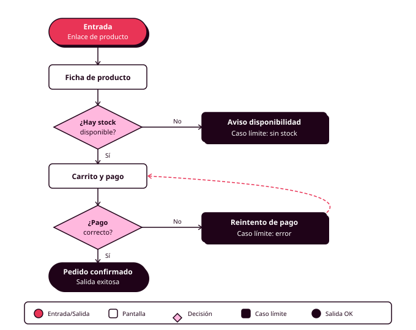

# Órbita 1 — Conocer a las personas

## 3. User flows: mapear el camino antes de dibujar las pantallas

  

    
Diapositivas del apartado

    
Qué es un user flow, cómo se representa, el happy path y los casos límite.

  

  <a href="../slides/orbita1_03_user_flows.pdf" target="_blank" rel="noopener" style="background:#E93456 !important; color:#ffffff !important; border:3px solid #1F0318 !important; box-shadow:4px 4px 0 #1F0318 !important; padding:14px 28px; font-weight:700; text-transform:uppercase; letter-spacing:1px; text-decoration:none !important; white-space:nowrap; border-bottom:none !important;">Descargar presentación →</a>

Un **user flow** es el recorrido que sigue una persona para conseguir algo dentro de tu aplicación. Muestra la secuencia de pasos, decisiones y pantallas desde que aparece la necesidad hasta que se resuelve o se abandona.

Mapear los flujos antes de dibujar pantallas tiene una razón práctica: una pantalla puede estar bien resuelta por sí sola y aun así formar parte de un flujo que no funciona. Un proceso de compra que pide datos que el usuario no tiene a mano, un registro que obliga a crear cuenta justo cuando alguien quiere hacer algo rápido, una confirmación que llega cuando la persona ya cerró la aplicación. Estos problemas no se ven mirando pantallas individuales. Se ven mirando el flujo completo (RA1-c, RA6-c).

### Cómo se representa un flujo

La notación es simple. Una píldora o elipse para el punto de entrada o salida. Un rectángulo para cada pantalla o estado. Un rombo para cada decisión, ya sea del usuario o del sistema. Flechas para las transiciones entre ellos.

El **punto de entrada** merece más atención de la que suele recibir. Las personas llegan a un flujo desde sitios distintos: desde la pantalla principal, desde una notificación, desde un enlace compartido, desde un resultado de búsqueda. Cada punto de entrada implica un estado de conocimiento diferente. El flujo tiene que funcionar para todos ellos.

Los rombos de decisión generan siempre al menos dos ramas. Cada rama tiene que llevar a algún sitio definido. Las ramas que terminan en el vacío son huecos del diseño que aparecerán después como pantallas de error sin resolver.

### El happy path y los casos límite

El **happy path** es el recorrido ideal: el usuario hace exactamente lo que el diseño espera, todo funciona, el objetivo se cumple. Es el flujo más fácil de mapear y el que menos información aporta, porque describe el escenario que menos problemas va a tener.

El valor del mapeo está en los **casos límite**: qué pasa cuando el usuario introduce mal la contraseña tres veces, cuando se corta la conexión a mitad de un pago, cuando vuelve a un carrito de hace dos semanas, cuando intenta acceder a contenido que ya se ha eliminado. Cada uno de estos escenarios necesita una respuesta diseñada.

Descubrir estos casos ahora, sobre un diagrama en FigJam, lleva minutos. Descubrirlos en producción lleva usuarios.

Aquí es donde las personas que construiste te son útiles. Recorre cada flujo desde la perspectiva de cada persona y pregúntate dónde se atascaría. La persona que usa la aplicación en el transporte público con una mano: ¿puede completar este flujo con interrupciones? ¿El flujo guarda el estado si cierra la aplicación a mitad? La persona que usa lector de pantalla: ¿hay algún paso que dependa exclusivamente de información visual? Estas preguntas hechas ahora sobre un diagrama evitan rediseños completos más adelante (RA5-a, RA6-c).

### Cuántos flujos y con qué detalle

Para el proyecto de este módulo, cubre las tareas críticas: las que sin ellas la aplicación pierde su sentido. Entre tres y cinco flujos bien desarrollados son suficientes. Cada uno debe incluir el happy path y al menos dos o tres casos límite.

El nivel de detalle correcto es el que permite tomar decisiones. Un flujo que solo dice "el usuario se registra" no tiene información de diseño. Uno que detalla cada campo del formulario ya es un wireframe. El punto intermedio: pantallas como unidades, decisiones explícitas, estados de error y de éxito identificados.

### Los flujos como guión de evaluación

Los user flows que construyas ahora tienen una segunda vida en la Órbita 5: serán el guión del cognitive walkthrough, donde recorres la interfaz terminada paso a paso comprobando si una persona real podría completar cada tarea sin ayuda. Un flujo bien documentado ahora es un protocolo de test gratuito después (RA6-e).

### Formato y herramienta

Los flujos se construyen en FigJam, junto a las personas y el brief, vinculados al proyecto principal de Figma. Usa las formas estándar y conectores automáticos. Cada flujo lleva un título con el objetivo que cubre, la persona o personas a las que sirve, y anotaciones en los puntos donde una decisión de diseño quedó abierta.

Si usas IA para generar un primer borrador de flujo o para identificar casos límite, el protocolo es el habitual: registro en `CHANGELOG.md`. Un caso límite sugerido por la IA que no sabes explicar es un caso límite que no has analizado.

### Lo que te llevas de este apartado

Un user flow mapea el camino completo, de principio a fin. El happy path apenas aporta información nueva: el valor real está en los casos límite, revisados con cada persona como filtro.
