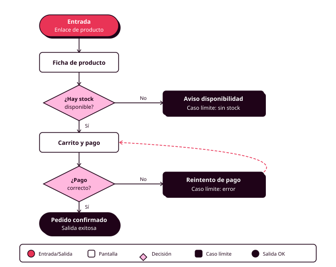

# Órbita 1 — Conocer a las personas

## 3. User flows: del MVP al recorrido completo

  

    
Diapositivas del apartado

    
El MVP como punto de partida, qué es un user flow, cómo se representa, el happy path y los casos límite.

  

  <a href="../slides/orbita1_03_user_flows.pdf" target="_blank" rel="noopener" style="background:#E93456 !important; color:#ffffff !important; border:3px solid #1F0318 !important; box-shadow:4px 4px 0 #1F0318 !important; padding:14px 28px; font-weight:700; text-transform:uppercase; letter-spacing:1px; text-decoration:none !important; white-space:nowrap; border-bottom:none !important;">Descargar presentación →</a>

Un **user flow** es el camino que sigue una persona para conseguir algo dentro de tu aplicación: la secuencia de pasos, decisiones y pantallas desde que aparece la necesidad hasta que se resuelve (o hasta que la persona se rinde). Antes de dibujar ninguno, necesitas tener claro qué hace tu producto en esta primera versión. Y para eso está el MVP.

### El MVP: qué entra y qué se queda esperando

El **MVP** (producto mínimo viable) es la versión más pequeña de tu producto que ya resuelve de verdad el problema de tu persona primaria. Hace pocas cosas y las hace enteras. Si el producto final fuera un coche, el MVP sería un patinete: algo que ya te lleva de un sitio a otro. Una rueda suelta, por muy bien acabada que esté, no lleva a nadie a ninguna parte.

En cuanto empiezas a pensar en tu app del polideportivo, las ideas llegan solas: chat para el grupo, ranking de jugadores, buscador de compañeros, notificaciones cuando quede una pista libre, sincronizar con el calendario. Todas suenan bien. Pero el problema de Lucía es reservar la pista del jueves sin pelearse con nadie, y para eso le basta con ver qué está libre, reservar, pagar y poder cancelar. Eso es el MVP. Lo demás se apunta y espera.

El método es este. Abre la ficha de tu persona primaria y busca su objetivo principal. Haz dos columnas, dentro y fuera, y pasa cada funcionalidad por tres preguntas: ¿la necesita tu persona primaria para completar su tarea principal?, ¿puedes construirla con el tiempo y las herramientas del módulo?, ¿tiene mientras tanto una alternativa aceptable? Cada respuesta tiene que apoyarse en un criterio, y "me apetece" no cuenta. Si la respuesta a la primera es no, la funcionalidad se queda fuera de esta versión, a la espera de la siguiente (RA1-c).

El resultado es una lista corta y defendible: lo que tendrá tu producto en esta versión y una frase por cada cosa que se quedó fuera explicando por qué puede esperar. Guárdala en el mismo tablero de FigJam donde vive el resto de la capa 0. A partir de aquí es tu referencia, empezando por los flujos de este mismo apartado.

### Cómo se dibuja un flujo

La notación es sencilla. Una píldora o elipse para la entrada y la salida. Un rectángulo para cada pantalla o estado. Un rombo para cada decisión, sea de la persona o del sistema. Y flechas para las transiciones.

El **punto de entrada** merece más atención de la que suele recibir. La gente llega a un flujo desde sitios muy distintos: la pantalla principal, una notificación, un enlace que le ha pasado alguien por WhatsApp, un resultado de búsqueda. Cada entrada supone que la persona sabe cosas distintas. Quien llega desde el enlace del grupo ("he reservado la pista 3, ¿os viene bien?") aterriza en medio de una reserva sin haber visto la portada. El flujo tiene que funcionarle también a esa persona.

Cada rombo abre al menos dos ramas, y cada rama tiene que acabar en algún sitio definido. Una rama que termina en el vacío es un hueco del diseño que algún día aparecerá como una pantalla de error que nadie diseñó.

### El happy path y los casos límite

El **happy path** es el recorrido ideal: la persona hace justo lo que el diseño espera, todo funciona y el objetivo se cumple. Es el flujo más fácil de dibujar y el que menos te enseña, porque describe precisamente el escenario que menos problemas va a dar.

Lo interesante está en los **casos límite**. Qué pasa cuando alguien falla la contraseña tres veces. Cuando se corta la conexión a mitad del pago. Cuando dos personas intentan reservar la misma pista en el mismo segundo. Cuando Manuel vuelve a una reserva que dejó a medias ayer. Cada uno de esos escenarios necesita una respuesta diseñada.

Descubrir estos casos ahora, sobre un diagrama, te lleva minutos. Descubrirlos en producción te cuesta usuarios.

Aquí es donde tus personas empiezan a trabajar para ti. Recorre cada flujo en la piel de cada una y pregúntate dónde se atascaría. Lucía, en el autobús y con una mano: ¿puede terminar la reserva si la interrumpen dos veces? ¿Se guarda lo que llevaba si cierra la app para contestar un mensaje? Una persona que usa lector de pantalla: ¿hay algún paso que dependa solo de información visual, como una pista "libre" marcada únicamente en verde? Estas preguntas, hechas hoy sobre un diagrama, te ahorran rediseños enteros dentro de dos meses (RA5-a, RA6-c).

### El flujo del MVP y los flujos complementarios

Empieza por un único flujo que recorra el MVP de principio a fin: entra en la aplicación, usa cada funcionalidad del MVP en el orden real en que se usaría, y sale. Dentro de ese recorrido, el happy path completo y al menos dos o tres casos límite en los puntos críticos (el pago, el registro, cualquier paso donde algo pueda torcerse). Este es el flujo de referencia de todo el módulo.

Si al dibujarlo descubres una tarea crítica que ese flujo no cubre bien (la tarea de una persona secundaria, o un escenario que se sale del camino principal pero que tu producto tiene que resolver igualmente), dibújala aparte como flujo complementario. Un flujo complementario se justifica cuando te obliga a tomar decisiones de diseño que el del MVP no te pide. Hacer flujos para llegar a un número es perder la tarde.

El nivel de detalle correcto es el que te permite decidir. Un flujo que solo dice "el usuario se registra" no tiene ninguna información de diseño. Uno que detalla cada campo del formulario ya es un wireframe. El punto medio: pantallas como unidades, decisiones explícitas y estados de error y de éxito identificados.

### El flujo como guion de evaluación

El user flow que hagas ahora tiene una segunda vida. En la Órbita 5 será el guion del **cognitive walkthrough**, la prueba en la que recorres la interfaz terminada paso a paso comprobando si una persona real podría completarla sin ayuda. Un flujo bien documentado hoy es un protocolo de test que te encuentras hecho dentro de unos meses (RA6-e).

### Formato y herramienta

El flujo se dibuja en FigJam, junto a las personas y el MVP, con las formas estándar y conectores automáticos. Lleva un título con el alcance que cubre, la persona o personas a las que sirve y una anotación en cada punto donde una decisión de diseño quedó abierta.

Si usas IA para un primer borrador del flujo o para buscar casos límite, el protocolo es el de siempre: registro en el `CHANGELOG.md`. Y una advertencia: un caso límite que te sugirió la IA y que no sabes explicar es un caso límite que todavía no has analizado.

El esquema de abajo muestra un flujo completo de otro dominio, una compra como invitado, con su happy path y sus ramas de error.

