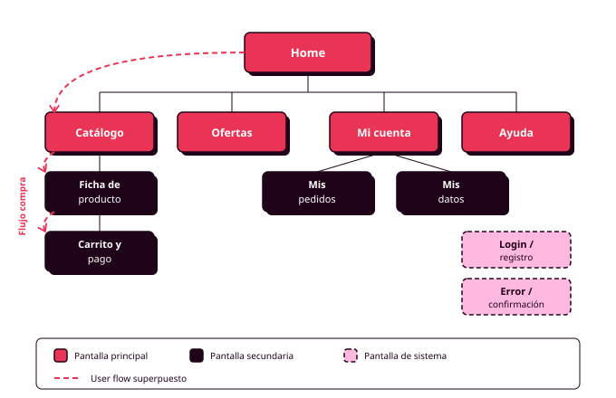

# Órbita 1 — Conocer a las personas

## 4. Arquitectura de la información y sitemap

  

    
Diapositivas del apartado

    
Arquitectura de la información, card sorting, amplitud frente a profundidad y el sitemap.

  

  <a href="../slides/orbita1_04_arquitectura_informacion.pdf" target="_blank" rel="noopener" style="background:#E93456 !important; color:#ffffff !important; border:3px solid #1F0318 !important; box-shadow:4px 4px 0 #1F0318 !important; padding:14px 28px; font-weight:700; text-transform:uppercase; letter-spacing:1px; text-decoration:none !important; white-space:nowrap; border-bottom:none !important;">Descargar presentación →</a>

### Qué es

La arquitectura de la información organiza y nombra el contenido de tu producto: qué pantallas y funcionalidades tiene, cómo se agrupan y cómo se llama cada cosa. El sitemap es el diagrama que representa esa organización: un árbol con la home en la raíz, un nodo por pantalla y líneas que marcan la jerarquía entre ellas (RA1-c).

### Para qué sirve

Le sirve al usuario para encontrar contenido sin perderse: cuando la estructura y los nombres son predecibles, sabe dónde buscar y qué va a encontrar antes de pulsar. Te sirve a ti como diseñador para decidir, antes de dibujar ninguna pantalla, dónde vive cada pieza de contenido de tu MVP.

### Cómo se crea

Se construye en tres pasos, siempre después de tener personas, MVP y user flow: la organización correcta depende de cómo piensan tus personas, el MVP marca qué contenido entra de verdad, y el flujo que ya mapeaste te da una primera pista de cómo se conecta ese contenido.

**1. Inventario.** Reúne la lista completa de pantallas, funcionalidades y tipos de contenido que va a tener tu producto. Sale de dos fuentes: los referentes que analizaste al principio de la órbita (qué contenido incluyen productos parecidos al tuyo) y las funcionalidades de tu MVP (qué entra en esta versión y qué queda fuera). Si algo no aparece en ninguna de las dos fuentes, pregúntate si hace falta de verdad.

**2. Agrupación.** Descubre cómo agrupa el contenido la cabeza de tu usuario con el card sorting: das a varias personas una tarjeta por cada elemento del inventario y les pides que las agrupen como les parezca natural y pongan un nombre a cada grupo. Hazlo con cuatro o cinco compañeros que encajen en tus perfiles de persona, en FigJam, con notas adhesivas como tarjetas. Los agrupamientos que se repiten entre participantes marcan la estructura que tu producto debería tener.

**3. Mapeo.** Convierte los grupos en el sitemap: un nodo por pantalla, la home como raíz, líneas que marcan jerarquía. Distingue tres tipos de nodo: pantallas principales (accesibles desde la navegación), secundarias (accesibles desde otras pantallas) y de sistema (login, errores, confirmaciones).

### Dos decisiones al construirlo

**Amplitud o profundidad.** Una estructura amplia pone muchas opciones en el primer nivel: todo a pocos clics, pero el menú inicial puede abrumar. Una estructura profunda pone pocas opciones iniciales y más niveles: cada pantalla es simple, pero llegar al contenido cuesta más pasos. Para este módulo, las funcionalidades de tu MVP deben alcanzarse en tres niveles de navegación como máximo (RA6-c).

**Cómo nombrar cada sección.** Usa las palabras que tus personas emplearon en las entrevistas para describir sus tareas. Un nombre funciona cuando el usuario predice qué va a encontrar antes de pulsar: "Mis pedidos" cumple, "Panel de actividad" no. La navegación funciona mejor cuanto más convencional es (RA6-h).

### Verificación final

Antes de dar el sitemap por terminado, verifica dos cosas. Primero, contra tu MVP: todo lo que está dentro tiene una pantalla o sección donde vivir, y nada de lo que dejaste fuera se ha colado en el sitemap. Segundo, contra el user flow que ya mapeaste: recórrelo sobre el sitemap y comprueba que cada paso encuentra una pantalla, sin huecos ni nombres que no coincidan.

Si usas IA para proponer una estructura inicial, recuerda que genera la arquitectura más frecuente para ese tipo de producto: un punto de partida razonable, que tu card sorting y tus personas tienen que corregir. La distancia entre esa estructura genérica y la tuya final demuestra que hubo un proceso de diseño detrás (RA1-c).
