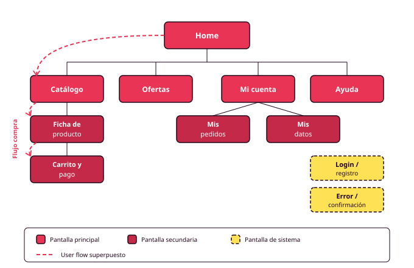

# Órbita 1 — Conocer a las personas

## 5. Arquitectura de la información y sitemap

  

    
Diapositivas del apartado

    
Arquitectura de la información, card sorting, amplitud frente a profundidad y el sitemap.

  

  <a href="slides/orbita1_05_arquitectura_informacion.pdf" target="_blank" rel="noopener" style="background:#E93456; color:#1a1a1a; border:3px solid #1a1a1a; box-shadow:4px 4px 0 #1a1a1a; padding:14px 28px; font-weight:700; text-transform:uppercase; letter-spacing:1px; text-decoration:none; white-space:nowrap;">Descargar presentación →</a>

La **arquitectura de la información** es la forma en que organizas y nombras el contenido de un producto para que las personas puedan encontrarlo. Si los user flows describen cómo se mueve alguien por la aplicación para conseguir algo, la arquitectura describe qué contiene la aplicación, cómo está agrupado y cómo se llama cada cosa. El **sitemap** es su representación visual: un diagrama jerárquico de todas las pantallas y las relaciones entre ellas (RA1-c).

Primero las personas, porque la organización correcta depende de cómo piensan quienes van a buscar el contenido. Después los flujos, porque revelan qué recorridos son críticos. Y solo entonces la arquitectura, porque a estas alturas ya sabes qué tiene que estar cerca de qué y qué puede vivir más profundo.

### Organiza según cómo piensa el usuario, no según cómo funciona el sistema

El error más habitual al estructurar una aplicación es organizarla según la lógica interna del sistema o del negocio: por tipos de datos, por departamentos, por módulos técnicos. Esa organización tiene sentido para quien construye el producto, pero no para quien lo usa.

La organización útil refleja cómo piensa el usuario. Si tus personas piensan en "cosas que tengo que hacer hoy" y la aplicación organiza por "proyectos, etiquetas y filtros", el usuario tiene que traducir constantemente entre su forma de pensar y la tuya. Cada traducción es un pequeño esfuerzo. El esfuerzo acumulado cansa y aleja.

La técnica para descubrir cómo piensa el usuario es el **card sorting**: das a varias personas tarjetas con los contenidos de tu aplicación y les pides que las agrupen como les parezca natural y nombren cada grupo. Los agrupamientos que se repiten entre participantes son los que señalan la estructura que el producto debería tener. Para este módulo puedes hacerlo con compañeros de clase que encajen en tus perfiles de persona. Con cuatro o cinco participantes ya emergen los patrones principales. FigJam funciona perfectamente: notas adhesivas como tarjetas, diez minutos por participante.

### Amplitud frente a profundidad

Toda arquitectura decide entre dos extremos. Una estructura **amplia** ofrece muchas opciones en el primer nivel: todo está a pocos clics, pero el menú inicial puede abrumar. Una estructura **profunda** ofrece pocas opciones iniciales y muchos niveles: cada pantalla es simple, pero llegar al contenido requiere varios pasos.

La decisión depende de tus personas y sus tareas. Como regla práctica para el proyecto de este módulo: las tareas críticas que identificaste en los flujos deberían ser alcanzables en un máximo de tres niveles de navegación. Lo que esté más profundo tiene que estarlo por una decisión justificada, no porque nadie pensó dónde ponerlo (RA6-c).

### Nombrar es una decisión de diseño

Cada sección del sitemap necesita un nombre, y ese nombre importa. Una etiqueta funciona cuando el usuario puede predecir qué encontrará detrás antes de pulsar. "Mis pedidos" es predecible. "Panel de actividad" obliga a pulsar para descubrir qué hay.

Los nombres deben salir del vocabulario de tus personas, que ya conoces por las entrevistas. Las palabras que usaron para describir sus tareas son candidatas directas. La navegación funciona mejor cuanto más convencional es: el lugar para la originalidad es el contenido, no el menú (RA6-h).

### Construir el sitemap

El sitemap se construye en FigJam, en el mismo archivo donde viven las personas y los flujos. Un nodo por pantalla o sección, líneas que indican jerarquía, la home como nodo raíz. Distingue visualmente tres tipos de nodo: pantallas principales (accesibles desde la navegación), pantallas secundarias (accesibles desde otras pantallas) y pantallas de sistema (login, errores, confirmaciones).

Antes de dar el sitemap por terminado, superpón mentalmente cada user flow sobre él y comprueba que el recorrido es posible y razonable. Si un flujo crítico exige saltar entre ramas alejadas del árbol, la arquitectura está penalizando una tarea importante.

Si usas IA para proponer una estructura inicial de sitemap, ten en cuenta que lo que genera es genérico: la arquitectura más frecuente para ese tipo de producto. Puede ser un punto de partida razonable, pero tu card sorting y tus personas son los que la tienen que corregir. La distancia entre la estructura genérica y la tuya final es la evidencia de que hubo un proceso de diseño (RA1-c).

### El entregable de la órbita, completo

Con el sitemap se cierra el conjunto de artefactos de la Órbita 1: brief de proyecto, personas, user flows y sitemap, todo en FigJam vinculado al archivo principal de Figma. En la Órbita 2 empezarás a tomar decisiones visuales —color, tipografía, espaciado— y cada una de ellas tendrá que poder justificarse señalando algo que está en esta capa.
