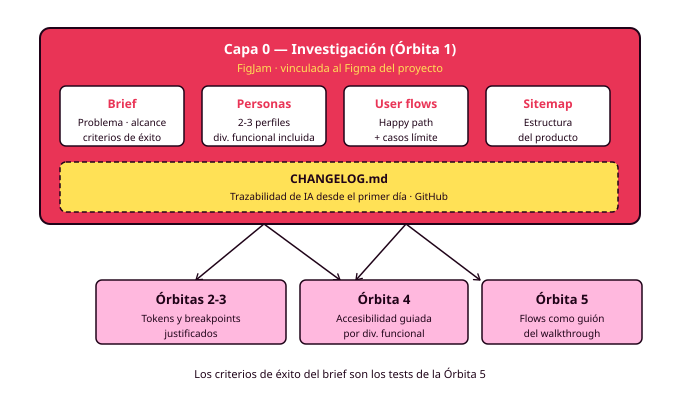

# Órbita 1 — Conocer a las personas

## 6. El brief de proyecto y el entregable de la órbita

El **brief de proyecto** es el documento que dice qué vas a construir, para quién y cómo sabrás que funciona. Tiene una particularidad curiosa: es el primero en orden lógico y el último en cerrarse. Lo empiezas el primer día con una hipótesis y lo terminas cuatro semanas después con una definición respaldada por datos. Si al final se parece demasiado a lo que escribiste el primer día, algo ha fallado por el camino.

### Qué contiene el brief

El brief de este módulo es corto: una o dos páginas en FigJam que cualquiera pueda leer en cinco minutos. Si tu profesor necesita diez, sobra algo. Tiene cinco elementos.

**El problema que resuelve el producto**, contado desde las personas y respaldado por la investigación. Haz una prueba: tapa tus datos y lee la frase. Si se sostiene igual de bien sin ellos, seguramente describe un problema que supusiste. Los problemas que encuentras investigando llevan datos pegados.

**El alcance**: qué entra y qué se queda fuera. Ya lo acotaste al definir el MVP, y el brief lo recoge. El producto resuelve bien lo que decidiste que entraba. Lo demás espera a la siguiente versión.

**Las personas**, enlazadas. El brief enlaza a las fichas, con una línea por persona que resume quién es y qué papel tiene.

**Los criterios de éxito**: cómo sabrás que el diseño funciona. En este módulo se escriben como afirmaciones verificables sobre tus personas. Por ejemplo: "Lucía puede reservar una pista para el jueves sin ayuda y en menos de un minuto" o "Manuel puede completar la misma reserva con la letra al 200 % y sin perder ningún botón fuera de la pantalla". Estos criterios serán el guion de los tests de la Órbita 5, así que escribirlos ahora es como redactar tu propio examen (RA6-b, RA6-f).

**Las restricciones**: las tecnológicas (las del proyecto coordinado con DWEC y DWES), las de tiempo y las que imponen tus personas (dispositivos, conectividad, tecnologías de apoyo).

### El entregable completo

Con el brief cerrado, el entregable de la Órbita 1 son seis artefactos vinculados entre sí, cuatro en FigJam y dos en Figma.

En **FigJam**: el brief de proyecto, las fichas de personas, el MVP con el user flow completo (y los flujos complementarios que hayas dibujado) y el sitemap.

En **Figma**: los wireframes lo-fi de todas las pantallas del happy path (con los mismos nombres que en el sitemap) y el prototipo navegable que las conecta con interacciones básicas.

Los dos archivos van enlazados y son la referencia permanente del resto del módulo. Cualquier decisión de las órbitas siguientes tendría que poder rastrearse hasta algo que construiste aquí.

Si has usado IA en cualquier momento de la órbita, el `CHANGELOG.md` del repositorio recoge cada uso: qué pediste, qué te dio, qué conservaste, qué cambiaste y por qué. Ese registro empieza aquí y te acompaña hasta la defensa final.

### Cómo se evalúa

Esta órbita trabaja sobre todo el RA1 y el RA6. La evaluación combina la rúbrica sobre lo que entregas con la **auditoría de decisión oral**, que puede llegar en cualquier momento del curso. También en marzo, sobre algo que cerraste en octubre.

Las preguntas de la auditoría siempre piden el porqué de una decisión y esperan una respuesta anclada en datos. ¿Por qué Lucía es la persona primaria? ¿De qué entrevista sale esta frustración? ¿Por qué el error de pago se resuelve con un reintento y no devolviéndote al calendario? ¿Por qué "Mis reservas" está en el primer nivel de navegación? ¿Por qué esta reserva se completa en tres pantallas? Una respuesta válida señala tu propia investigación. Una respuesta del tipo "es lo habitual" o "me lo sugirió la herramienta" señala una decisión que todavía es de otro.

Así que guarda tus notas de entrevista como si fueran a pedírtelas. Porque te las voy a pedir.
