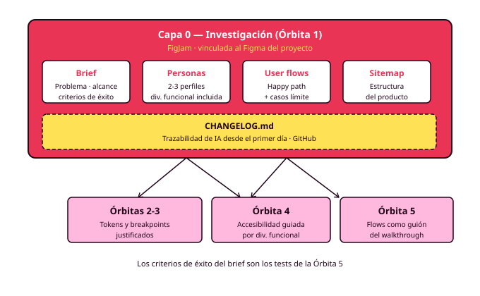

# Órbita 1 — Conocer a las personas

## 7. El brief de proyecto y el entregable de la órbita

  

    
Diapositivas del apartado

    
El brief de proyecto, el entregable completo de la órbita y cómo se evalúa.

  

  <a href="slides/orbita1_07_brief_y_entregable.pdf" target="_blank" rel="noopener" style="background:#E93456; color:#1a1a1a; border:3px solid #1a1a1a; box-shadow:4px 4px 0 #1a1a1a; padding:14px 28px; font-weight:700; text-transform:uppercase; letter-spacing:1px; text-decoration:none; white-space:nowrap;">Descargar presentación →</a>

El brief de proyecto es el documento que define qué vas a construir, para quién y con qué criterios sabrás que funciona. Es el primero en orden lógico y el último en cerrarse, porque sus contenidos se van completando con lo que la investigación revela: empiezas con una hipótesis y terminas con una definición respaldada por datos.

### Qué contiene el brief

El brief de este módulo es corto: una o dos páginas en FigJam que cualquiera pueda leer en cinco minutos. Tiene cinco elementos.

**El problema que resuelve el producto**, formulado desde la perspectiva de las personas y respaldado por la investigación. Si esta frase se sostiene sin los datos que recogiste, probablemente describes un problema que supusiste en lugar de uno que encontraste.

**El alcance**: qué entra y qué queda fuera. Definir lo que el producto deliberadamente no hace es tan importante como definir lo que hace. El alcance se acota con las tareas críticas de los user flows: el producto resuelve bien esas tres a cinco tareas, y todo lo demás es secundario o queda fuera de esta versión. Esto conecta con el concepto de MVP que probablemente ya conoces: la versión mínima que resuelve el problema principal sin añadir nada que pueda esperar.

**Las personas, referenciadas**. El brief enlaza a las fichas, con una línea por persona que resuma quién es y qué papel juega.

**Los criterios de éxito**: cómo sabrás que el diseño funciona. En este módulo tienen forma de afirmaciones verificables sobre las personas: "[persona primaria] puede completar [tarea crítica] sin ayuda en menos de [tiempo razonable]", "[persona con diversidad funcional] puede completar el mismo flujo con su tecnología de apoyo". Estos criterios serán el guión de los tests de la Órbita 5. Escribirlos ahora es escribir tu propia evaluación (RA6-b, RA6-f).

**Las restricciones**: tecnológicas (las del proyecto coordinado con DWEC y DWES), de tiempo y las que impongan tus propias personas (dispositivos, conectividad, tecnologías de apoyo).

### El entregable completo

Con el brief cerrado, el entregable de la Órbita 1 queda compuesto por seis artefactos vinculados entre sí: cuatro en FigJam y dos en Figma.

En FigJam: el brief de proyecto, las fichas de personas, los user flows de las tareas críticas y el sitemap.

En Figma: los wireframes lo-fi de todas las pantallas del happy path (nombrados con el paso del flujo al que corresponden) y el prototipo navegable que las conecta con interacciones básicas.

Los dos archivos van vinculados entre sí y son la referencia permanente del resto del módulo. Cualquier decisión de las Órbitas siguientes debería poder rastrearse hasta algo construido aquí.

Si has usado IA en cualquier punto de la órbita, el `CHANGELOG.md` del repositorio recoge cada uso: qué pediste, qué generó, qué mantuviste, qué cambiaste y por qué. Este registro arranca aquí y acompañará al proyecto hasta la defensa final.

### Cómo se evalúa

Esta órbita trabaja principalmente RA1 y RA6. La evaluación combina la rúbrica sobre los artefactos entregados con la auditoría de decisión oral, que puede producirse en cualquier momento del curso, incluso meses después de cerrar esta órbita.

Las preguntas de auditoría siempre piden el porqué de una decisión y esperan una respuesta anclada en datos: ¿por qué esta persona es la primaria?, ¿de qué entrevista sale esta frustración?, ¿por qué este flujo resuelve el error de pago con un reintento en lugar de volver al carrito?, ¿por qué esta sección está en el primer nivel de navegación?, ¿por qué este wireframe resuelve la tarea en tres pasos y no en cinco? Una respuesta válida señala investigación propia. Una respuesta del tipo "es lo habitual" o "lo sugirió la herramienta" señala una decisión que todavía es de otro.

Un artefacto con errores formales pero con decisiones bien justificadas vale más en este módulo que un artefacto impecable que no sabes defender.

### De aquí a la Órbita 2

Las personas, los flujos y los wireframes pueden refinarse si las órbitas siguientes revelan que algo estaba mal calibrado. Eso es parte del proceso. Lo que cambia a partir de ahora es el tipo de trabajo: en la Órbita 2 empezarás a fundar el sistema visual (color, tipografía, espaciado, todo como tokens) y cada elección tendrá que pasar por el filtro de lo que construiste aquí. Los wireframes que acabas de hacer son el esqueleto sobre el que ese sistema visual tomará forma.

